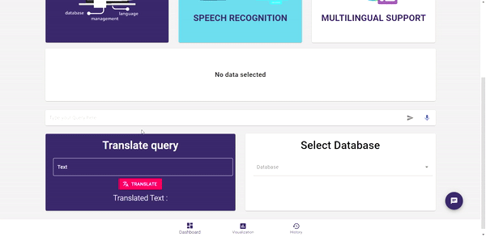
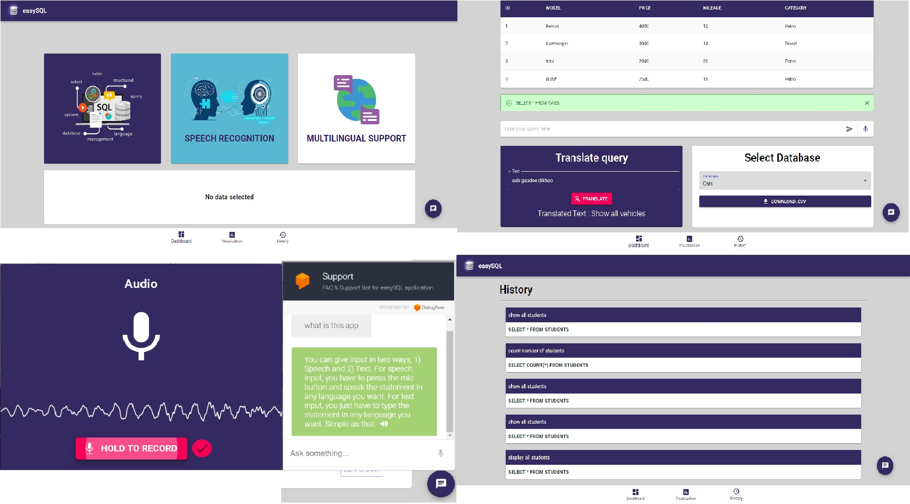

# easySQL
Query SQL Tables using Natural Language, without writing a query



# Table of Contents

* [Description](https://github.com/amurto/easySQL#description)
* [Dependencies](https://github.com/amurto/easySQL#dependencies)
* [Installation](https://github.com/amurto/easySQL#installation)
  * [Prerequisites](https://github.com/amurto/easySQL#prerequisites)
  * [Instructions](https://github.com/amurto/easySQL#instructions)
* [Usage](https://github.com/amurto/easySQL#usage)
* [License](https://github.com/amurto/easySQL#license)

# Description

easySQL automates the process of using Natural Language to conduct queries on Relational databases. It supports Speech-to-text and around 30 Languages.
  
### nlp2SQL
Named Entity Recognition using node-nlp for tagging query intent, tables and metadata.
Supports multiple query statements.

### Speech Recognition
Speech-to-text option available for querying tables directly through voice.

### Multilingual Translation
Supports detection of input language and translation to English.
Supports around 30 languages including Hindi.

### Tables downloadable in csv format
Option to download SQL tables in csv format.

### Chatbot Assistance
FAQ chatbot to help user get acquainted with the app.

### Data Visualization
Visualization of SQL tables using Plotly.
Compare column v/s column and plot it using various charts.
Option to edit and download plots in png format.

### Query History
Stores successful user entered queties, both text and SQL query.
 
## Webapp Images


# Dependencies

* [npm](https://www.npmjs.com/)
* [Express.js](https://expressjs.com/)
* [MySQL](https://www.mysql.com/)
* [XAMPP](https://www.apachefriends.org/index.html)
* [React.js](https://reactjs.org/)
* [Plotly](https://plotly.com/javascript/)

# Installation

### Prerequisites

Install Node.js and npm using the link above. Follow instructions on their respecive websites. Npm is included with Node.js. Setup XAMPP server and load the [database](https://github.com/amurto/easySQL/blob/master/backend/database/nodemysql.sql) into MySQL tables. Copy the MySQL credentials and paste them appropriately in the [.env](https://github.com/amurto/easySQL/blob/master/backend/.env) file.

### Instructions

Clone the repository
```bash
git clone https://github.com/amurto/easySQL.git
```

Install all the dependencies on backend server
```bash
cd backend 
npm install
```

Install all the dependencies on frontend
```bash
cd frontend
npm install
```

# Usage

Run the admin server on port 5000
```bash
cd backend
npm start
```

Run the farmer client
```bash
cd frontend
npm start
```

Open a web browser and go to
```bash
http://localhost:3000
```

# License

[](https://opensource.org/licenses/MIT)

[MIT License Link](https://github.com/amurto/easySQL/blob/master/LICENSE)